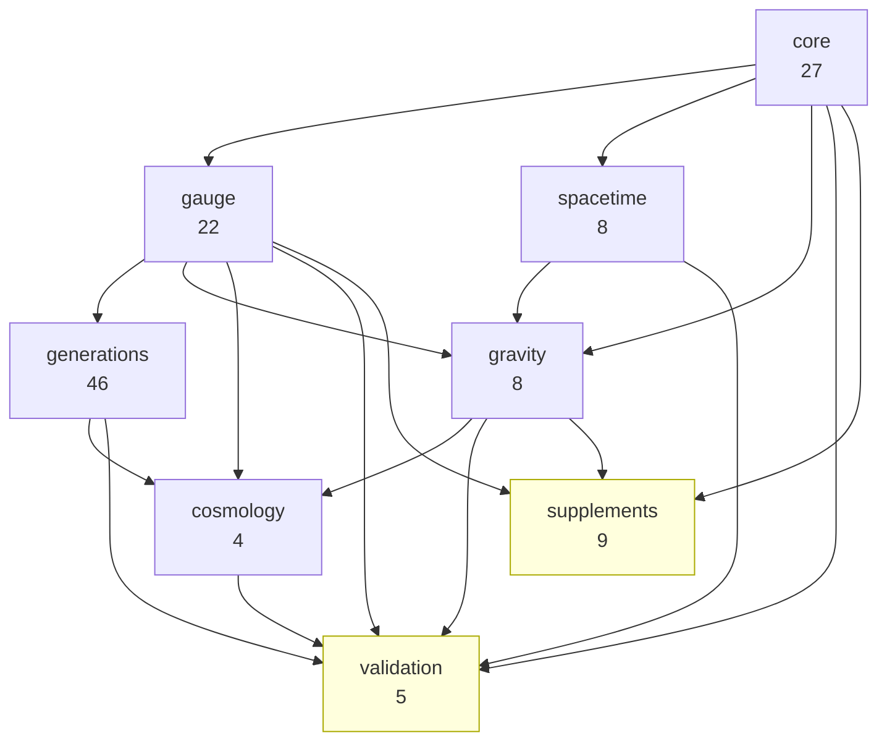

# APF v5.0 Architecture

## Module Map

The theorem bank is organized into 8 physics modules plus shared
infrastructure. The split follows the framework's logical structure:
the axiom produces quantum mechanics, which produces gauge theory,
which produces particle content, while independently producing
spacetime and gravity, which together produce cosmology.

### Derivation Chain (load-bearing)

```
A1 (axiom)
  │
  ▼
core (27)         Quantum admissibility skeleton
  │                 A1, M, NT, L_ε*, L_irr, L_nc, L_loc,
  │                 T0–T3, T_Born, T_CPTP, T_entropy, ...
  │
  ├──────────────────────────────────────────────┐
  ▼                                              ▼
gauge (22)        Particle content             spacetime (8)
  │                 T_gauge, T_field,             Arena emergence
  │                 T_Higgs, T_θ_QCD,             Δ_signature,
  │                 L_anomaly_free, ...           Δ_continuum, T8,
  │                                               T_Coleman_Mandula
  ▼                       │
generations (46)          │
  │  Mass/mixing          │
  │  T_CKM, T_PMNS,      │
  │  T_mass_ratios, ...   │
  │                       ▼
  │                 gravity (8)
  │                   T9_grav, T10, T_Bek,
  │                   T_graviton, L_WW, ...
  │                       │
  │                       ▼
  └──────────────► cosmology (4)
                    T11, T12, T12E, L_equip
```

### Firewall Modules (terminal, not load-bearing)

```
validation (5)    Observational comparisons
                    T_concordance, T_inflation,
                    T_baryogenesis, T_reheating, L_Sakharov

supplements (9)   Consistency demonstrations
                    T_spin_statistics, T_CPT, T_second_law,
                    T_decoherence, T_Noether, T_optical,
                    L_cluster, T_BH_information, L_naturalness
```

Nothing in the derivation chain depends on validation or supplements.
A reviewer can ignore both firewall modules and still see the
complete A1 → Standard Model → cosmology pipeline.

## Module Details

### core.py — 27 theorems

The axiom layer. Everything here follows from A1 (admissibility physics
enforced on distinguishable records) plus imported mathematical
structure. No physics beyond "admissibility physics → quantum probability."

Key contents: A1, Gleason → Born rule (T_Born), CPTP channels
(T_CPTP), von Neumann entropy (T_entropy), capacity bound algebra
(T_canonical), equilibrium measure (M_Omega).

### gauge.py — 22 theorems

How the capacity structure forces gauge symmetry. The cost-benefit
analysis (L_cost) requires internal symmetries; the allowed symmetries
are exactly SU(3)×SU(2)×U(1) (T_gauge); the field content follows
(T_field); the Higgs mechanism is forced (T_Higgs); CP structure is
determined (T_theta_QCD, L_strong_CP_synthesis); anomaly cancellation
is verified (L_anomaly_free); the proton is stable (T_proton); the
vacuum is absolutely stable (T_vacuum_stability).

### generations.py — 46 theorems

The mass/mixing monolith. Three generations arise from capacity
depth (T_capacity_ladder). The CKM and PMNS matrices follow from
holonomy phases on the generation path graph (T_CKM, T_PMNS).
Mass ratios follow from boundary projection and edge amplitudes
(T_mass_ratios). This module is deliberately monolithic — the
internal dependency web is too dense to split cleanly.

### spacetime.py — 8 theorems

How the capacity structure forces a 4D Lorentzian spacetime arena.
The five Delta theorems derive signature (+,-,-,-), continuum
structure, finite boundary conditions, causal ordering, and particle
identity. T8 derives d=4. T_Coleman_Mandula verifies the symmetry
factorization G = Poincaré × Gauge is forced, and SUSY is excluded.

### gravity.py — 8 theorems

Dynamics on the arena. Kept deliberately tight — every theorem here
is forced. T9_grav: Einstein equations are unique (Lovelock). T10:
Newton's constant from capacity counting. T_Bek: Bekenstein bound.
T_graviton: massless spin-2 with 2 DOF. L_Weinberg_Witten: all
particles pass WW constraints.

### cosmology.py — 4 theorems

Derived cosmological counting. T11: density fractions from the
capacity budget 3+16+42=61. T12: total gravitational load. T12E:
dark matter = gauge-singlet capacity. L_equip: horizon equipartition.
No observed numbers appear in this module.

### validation.py — 5 theorems (firewall)

Observational comparisons with imported fitting formulae and
experimental data. T_concordance: 12 observables vs predictions.
T_inflation: spectral index and tensor-to-scalar ratio.
T_baryogenesis: baryon asymmetry. T_reheating: reheat temperature.
L_Sakharov: three conditions verified.

### supplements.py — 9 theorems (firewall)

Consistency exhibitions. Everything here is correct and follows from
[P] theorems, but serves an explanatory rather than constructive
role. Includes: spin-statistics, CPT, second law, decoherence,
Noether correspondence, optical theorem, cluster decomposition,
black hole information preservation, hierarchy problem dissolution.

## Shared Infrastructure

- `_result.py` — Uniform result constructor and epistemic tag definitions
- `_linalg.py` — Zero-dependency linear algebra (complex matrices, eigenvalues, tensor products)
- `_helpers.py` — Backward-compatible wrappers for v4.x function names
- `_constants.py` — Centralized observational data (Planck 2018, PDG 2024, Fields 2020)
- `bank.py` — Lazy registry loader, CLI, `run_all()`

## Dependency DAG



Note: The dependency graph contains one known mutual-consistency
cycle at the gauge/generation interface (T4 ↔ T_confinement ↔
L_AF_capacity ↔ T22 ↔ T19 ↔ T_channels). These theorems verify
mutual consistency of gauge confinement and asymptotic freedom,
not strict derivation order.

## Tier System

Theorems are assigned to logical tiers reflecting derivation depth:

| Tier | Content | Count |
|------|---------|-------|
| -1 | Axiom and postulates (A1, M, NT) | 3 |
| 0 | Foundational lemmas and quantum structure | 24 |
| 1 | Gauge origin and field structure | 7 |
| 2 | Field content, channels, Higgs | 11 |
| 3 | Generation structure, masses, mixing | 46 |
| 4 | Gravity, Bekenstein, cosmological structure | 11 |
| 5 | Spacetime emergence (Delta theorems) | 6 |

Plus 21 v4.3.7 theorems spanning tiers 0–5.

## Design Principles

1. **Zero external dependencies.** The bank runs on stdlib only.
   No numpy, no scipy. This ensures reproducibility and auditability.

2. **Lazy execution.** No theorem logic runs at import time. The
   `register()` pattern adds function references; `run_all()` executes.

3. **Epistemic honesty.** Every theorem declares its proof status.
   Imported external theorems are flagged. Structural arguments
   are distinguished from rigorous proofs.

4. **Firewall isolation.** Weak arguments can't contaminate strong ones.
   Observational data can't contaminate derivations.

5. **Monolith where necessary.** The generations module is deliberately
   not split because the internal dependency web is too dense. Forced
   modular decomposition would create circular imports.
